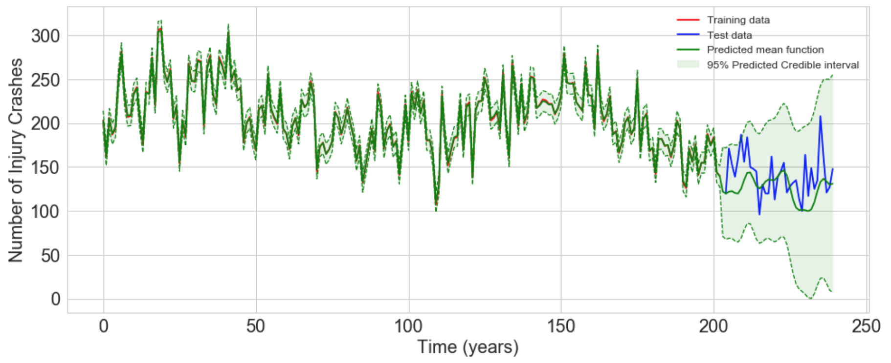

Long-range Forecasting and Pattern Discovery given Limited Data
==================================================================

Purpose
-------

This repo provides the code and data used to generate results in our
paper "**Long-range Forecasting and Pattern Discovery given Limited Data**"

Abstract
--------

DO TO.

Citation
--------

If you do end up using our code, please cite our paper as follows.

    Emaasit, D., Veeramisti, N., Paz, A., and Johnson, M., 2018. “Long-range Forecasting and Pattern Discovery given Limited Data.” ArXiv Preprint

Or using BibTex as follows:

    @article{emaasit2018long,
      title={Long-range Forecasting and Pattern Discovery given Limited Data},
      author={Emaasit, Daniel and Veeramisti, Naveen and Paz, Alexander, and Johnson, Matthew},
      journal={arXiv},
      year={2018}
    }

Getting Help
------------

Incase you need help running this code or have general questions, don't
hesitate to email us at <demaasit@haystax.com> or
<daniel.emaasit@gmail.com>.