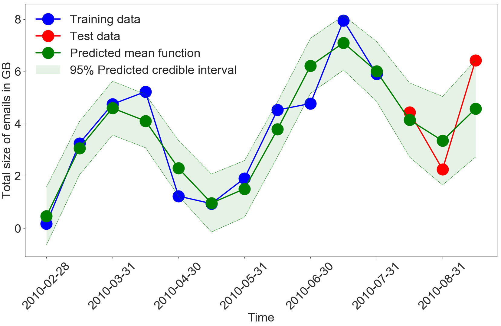

Capturing Structure Implicitly from Time-Series having Limited Data
=========================================================================

* Click this icon  to open the notebooks in a web broser.

Purpose
-------

This repo provides the code and data used to generate results in our
paper "**Capturing Structure Implicitly from Time-Series having Limited Data**"

Abstract
--------

Scientific fields such as insider-threat detection and highway-safety planning often lack sufficient amounts of time-series data to estimate statistical models for the purpose of scientific discovery. Moreover, the available limited data are quite noisy. This presents a major challenge when estimating time-series models that are robust to overfitting and have well-calibrated uncertainty estimates. Most of the current literature in these fields involve visualizing the time-series for noticeable structure and hard coding them into pre-specified parametric functions. This approach is associated with two limitations. First, given that such trends may not be easily noticeable in small data, it is difficult to explicitly incorporate expressive structure into the models during formulation.  Second, it is difficult to know *a priori* the most appropriate functional form to use. To address these limitations, a nonparametric Bayesian approach was proposed to implicitly capture hidden structure from time series having limited data. The proposed model, a Gaussian process with a spectral mixture kernel, precludes the need to pre-specify a functional form and hard code trends, is robust to overfitting and has well-calibrated uncertainty estimates. Bayesian modeling was adopted to account for uncertainty.

Citation
--------

Citation for the corresponding paper is as follows.

    Emaasit, D. and Johnson, M.(2018). Capturing Structure Implicitly from Time-Series having Limited Data. arXiv preprint arXiv:1803.05867

Or using BibTex as follows:

    @article{emaasit2018capturing,
      title={Capturing Structure Implicitly from Time-Series having Limited Data},
      author={Emaasit, Daniel and Johnson, Matthew},
      journal={arXiv preprint arXiv:1803.05867},
      year={2018}
    }

Getting Help
------------

Incase you need help running this code or have general questions, don't hesitate to email us at <demaasit@haystax.com> or <daniel.emaasit@gmail.com>.
